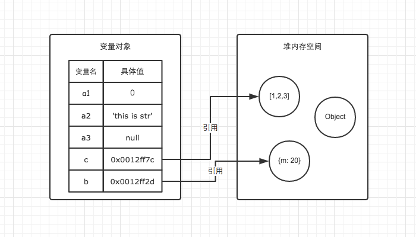

# 内存空间

**函数调用栈（栈），事件循环（队列），基础数据类型（变量对象），引用数据类型的值（堆内存）**

## 一、栈数据结构

执行上下文的执行顺序借用了栈数据结构的存取方式。

先进后出

## 二、堆数据结构

堆数据结构是一种树状结构。

## 三、队列

在 JavaScript 中，理解队列数据结构的目的主要是为了清晰的明白事件循环（Event Loop）的机制

先进先出

## 四、变量对象与基础数据类型

JavaScript 的执行上下文生成之后，会创建一个叫做变量对象的特殊对象，JavaScript 的基础数据类型往往都会保存在变量对象中。

基础数据类型都是一些简单的数据段，JavaScript 中有 5 中基础数据类型，分别是 Undefined、Null、Boolean、Number、String。基础数据类型都是按值访问，因为我们可以直接操作保存在变量中的实际的值。

## 五、引用数据类型与堆内存

与其他语言不同，JS 的引用数据类型，比如数组 Array，它们值的大小是不固定的。引用数据类型的值是保存在堆内存中的对象。JavaScript 不允许直接访问堆内存中的位置，因此我们不能直接操作对象的堆内存空间。在操作对象时，实际上是在操作对象的引用而不是实际的对象。因此，引用类型的值都是按引用访问的。


```js
var a = 20;
var b = a;
b = 30; //a不变

var m = { a: 10, b: 20 };
var n = m;
n.a = 15; //m:{a: 15, b: 20}
```

## 六、内存空间管理

```js
var a = 20; // 在内存中给数值变量分配空间
alert(a + 100); // 使用内存
a = null; // 使用完毕之后，释放内存空间
```

JavaScript 有自动垃圾收集机制，那么这个自动垃圾收集机制的原理是什么呢？其实很简单，就是找出那些不再继续使用的值，然后释放其占用的内存。垃圾收集器会每隔固定的时间段就执行一次释放操作。

在 JavaScript 中，最常用的是通过标记清除的算法来找到哪些对象是不再继续使用的，因此 a = null 其实仅仅只是做了一个释放引用的操作，让 a 原本对应的值失去引用，脱离执行环境，这个值会在下一次垃圾收集器执行操作时被找到并释放。而在适当的时候解除引用，是为页面获得更好性能的一个重要方式。
