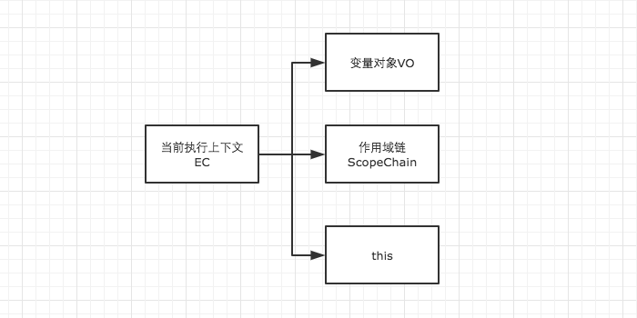
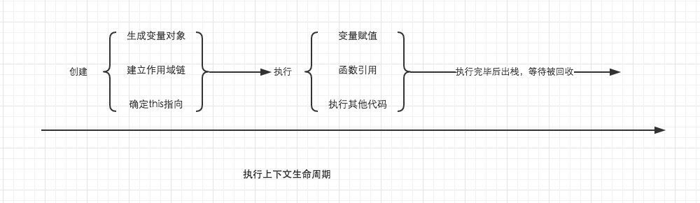
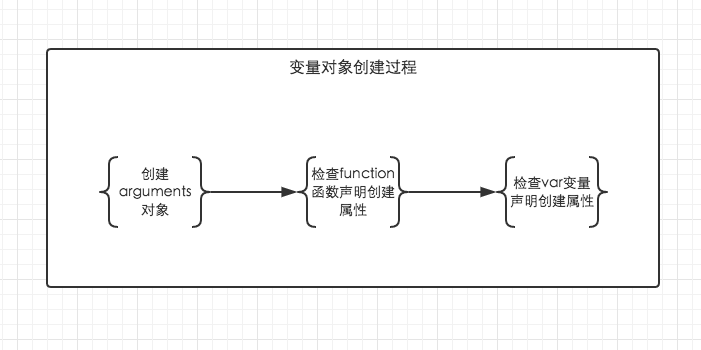

- 变量对象
- 作用域链
- this



当调用一个函数时（激活），一个新的执行上下文就会被创建。而一个执行上下文的生命周期可以分为两个阶段。

- 创建阶段
在这个阶段中，执行上下文会分别创建**变量对象**，建立作用域链，以及确定this的指向。

- 代码执行阶段
创建完成之后，就会开始执行代码，这个时候，会完成变量赋值，函数引用，以及执行其他代码。



## 变量对象

变量对象的创建，依次经历了以下几个过程。

1. 建立arguments对象。检查当前上下文中的参数，建立该对象下的属性与属性值。

2. 检查当前上下文的函数声明，也就是使用function关键字声明的函数。在变量对象中以函数名建立一个属性，属性值为指向该函数所在内存地址的引用。如果函数名的属性已经存在，那么该属性将会被新的引用所覆盖。

3. 检查当前上下文中的变量声明，每找到一个变量声明，就在变量对象中以变量名建立一个属性，属性值为undefined。如果该变量名的属性已经存在，为了防止同名的函数被修改为undefined，则会**直接跳过**，原属性值不会被修改。


```js
function foo() { console.log('function foo') }
var foo = 20;
console.log(foo); // 20
```

上面的三条规则仅仅适用于**变量对象的创建过程**。也就是执行上下文的创建过程。而foo = 20是在执行上下文的执行过程中运行的，输出结果自然会是20。对比下例。

```js
console.log(foo); // function foo
var foo = 20;
function foo() { console.log('function foo') }
```

```js
// 上栗的执行顺序为

// 首先将所有函数声明放入变量对象中
function foo() { console.log('function foo') }

// 其次将所有变量声明放入变量对象中，但是因为foo已经存在同名函数，因此此时会跳过undefined的赋值
// var foo = undefined;

// 然后开始执行阶段代码的执行
console.log(foo); // function foo
foo = 20;
```

```js
// demo2
function test() {
    console.log(foo);
    console.log(bar);

    var foo = 'Hello';
    console.log(foo);
    var bar = function () {
        return 'world';
    }

    function foo() {
        return 'hello';
    }
}

test();

//结果
ƒ foo() {
        return 'hello';
    }
undefined
Hello
```

```js
// 创建阶段
VO = {
    arguments: {...},
    foo: <foo reference>,
    bar: undefined
}
// 这里有一个需要注意的地方，因为var声明的变量当遇到同名的属性时，会跳过而不会覆盖
```

```js
// 执行阶段
VO -> AO
VO = {
    arguments: {...},
    foo: 'Hello',
    bar: <bar reference>,
    this: Window
}

```

## JavaScript 变量提升

- JavaScript 中，函数及变量的声明都将被提升到函数的最顶部。

JavaScript 中，变量可以在使用后声明，也就是变量可以先使用再声明。

- JavaScript 初始化不会提升

JavaScript 只有声明的变量会提升，初始化的不会。

```js
var x = 5; // 初始化 x
elem = document.getElementById("demo"); // 查找元素
elem.innerHTML = x + " " + y;           // x 为：5，y 为：undefined
var y = 7; // 初始化 y
```

- 全局上下文的变量对象

以浏览器中为例，全局对象为window。

全局上下文有一个特殊的地方，它的变量对象，就是window对象。而这个特殊，在this指向上也同样适用，this也是指向window。

```js
// 以浏览器中为例，全局对象为window
// 全局上下文
windowEC = {
    VO: Window,
    scopeChain: {},
    this: Window
}
```

除此之外，全局上下文的生命周期，与程序的生命周期一致，只要程序运行不结束，比如关掉浏览器窗口，全局上下文就会一直存在。其他所有的上下文环境，都能直接访问全局上下文的属性。

- let/const

let/const声明的变量，是否还会变量提升
