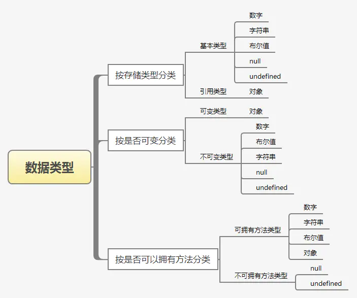

# 数据类型判断方法

## 数据类型

基本类型：String、Number、Boolean、Symbol、Undefined、Null

复杂（引用）数据类型：Object，Array，Function，RegExp，Date，Error

全局数据类型：Math



原生具备 Iterator 接口的数据结构如下。

Array
Map
Set
String
TypedArray
函数的 arguments 对象
NodeList 对象

Boolean类型转换：
    1.对于String:只有非空字符串为真
    2.对于Number:除了0和NaN之外都为真
    3.对于Boolean:true为真
    4.对于Object:除了null之外都为真
    5.undefined为false;

基本类型变量用八字节内存

## 1、typeof

typeof 是一个操作符，其右侧跟一个一元表达式，并返回这个表达式的数据类型。返回的结果用该类型的字符串(全小写字母)形式表示，包括以下 7 种：number、boolean、symbol、string、object、undefined、function 等。

- 对于基本类型，除 null 以外，均可以返回正确的结果。
- 对于引用类型，除 function 以外，一律返回 object 类型。
- 对于 null ，返回 object 类型。
- 对于 function 返回  function 类型。

## 2、instanceof

instanceof 是用来判断 A 是否为 B 的实例，表达式为：A instanceof B，如果 A 是 B 的实例，则返回 true,否则返回 false。 在这里需要特别注意的是：**instanceof 检测的是原型**

 A 的 __proto__ 指向 B 的 prototype 时，就认为 A 就是 B 的实例

从 instanceof 能够判断出 [ ].__proto__  指向 Array.prototype，而 Array.prototype.__proto__ 又指向了Object.prototype，最终 Object.prototype.__proto__ 指向了null，标志着原型链的结束。因此，[]、Array、Object 就在内部形成了一条原型链

**instanceof 只能用来判断两个对象是否属于实例关系， 而不能判断一个对象实例具体属于哪种类型。**

instanceof 操作符的问题在于，它假定只有一个全局执行环境。如果网页中包含多个框架，那实际上就存在两个以上不同的全局执行环境，从而存在两个以上不同版本的构造函数。如果你从一个框架向另一个框架传入一个数组，那么传入的数组与在第二个框架中原生创建的数组分别具有各自不同的构造函数。

```js
var iframe = document.createElement('iframe');
document.body.appendChild(iframe);
xArray = window.frames[0].Array;
var arr = new xArray(1,2,3); // [1,2,3]
arr instanceof Array; // false
```

## 3、constructor

当一个函数 F被定义时，JS引擎会为F添加 prototype 原型，然后再在 prototype上添加一个 constructor 属性

F 利用原型对象上的 constructor 引用了自身，当 F 作为构造函数来创建对象时，原型上的 constructor 就被遗传到了新创建的对象上， 从原型链角度讲，构造函数 F 就是新对象的类型。这样做的意义是，让新对象在诞生以后，就具有可追溯的数据类型。

1. null 和 undefined 是无效的对象，因此是不会有 constructor 存在的，这两种类型的数据需要通过其他方式来判断。

2. 函数的 constructor 是不稳定的，这个主要体现在自定义对象上，当开发者重写 prototype 后，原有的 constructor 引用会丢失，constructor 会默认为 Object

## 4、toString

toString() 是 Object 的原型方法，调用该方法，默认返回当前对象的 [[Class]] 。这是一个内部属性，其格式为 [object Xxx] ，其中 Xxx 就是对象的类型。

- 属性
length

- 方法

- 改变原数组

1. 移除数组末尾最后一项.pop()
返回删除的元素
如果你在一个空数组上调用 pop()，它返回 undefined
2. 在数组末尾添加一个或多个元素.push()
返回修改后数组长度
3. 移除数组第一项.shift()
返回移除的元素
4. 在数组头部添加一个或多个元素.unshift()
返回修改后数组长度
5. 对数组元素排序.sort()
返回排序后的数组
默认排序顺序是根据字符串Unicode码点
6. 颠倒数组元素.reverse()
返回颠倒后的数组
7. 删除或插入元素.splice()
返回数组删除的项
没有删除的项，返回空数组

- 不改变原数组

1. 合并两个或多个数组.concat()
返回新数组
2. 将数组所有元素连接成一个字符串.join()
返回连接后的字符串
3. 截取数组元素到新数组中.slice()
返回新数组
4. 获取查询元素第一次出现的索引.indexOf()
找不到查询元素，则返回-1
5. 获取查询元素最后一次出现的索引.lastIndexOf()
找不到查询元素，则返回-1
6. toString()返回由数组每个元素的字符串形式拼接而成的以逗号分隔的字符串
7. toLocaleString()返回一个字符串表示数组中的元素

- 迭代方法
每个方法接受含有三个参数的函数，三个参数为：数组中的项，元素索引，数组本身

1.every()，数组所有元素都满足要求则返回true，否则返回false
2.some()，只要有满足要求的就返回true
3.filter()，返回过滤后的结果数组
4.map()，返回在函数中处理过的数组
5.forEach()，遍历整个数组

```js
var map = Array.prototype.map
var a = map.call("Hello World", function(x) { 
  return x.charCodeAt(0); 
})
// a的值为[72, 101, 108, 108, 111, 32, 87, 111, 114, 108, 100]
```

