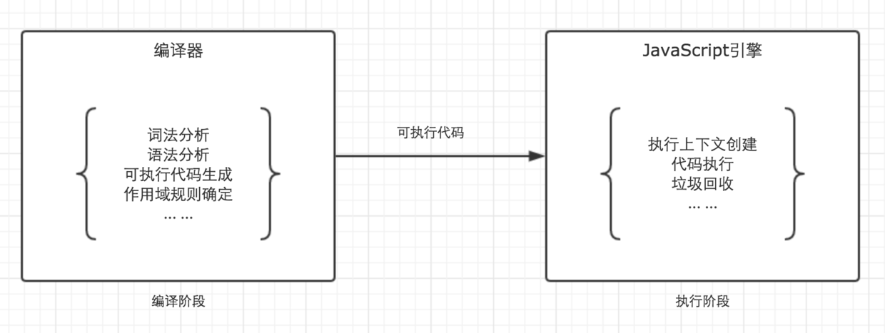

# 作用域链与闭包

## 作用域与作用域链

- 作用域

JavaScript中只有全局作用域与函数作用域。

作用域与执行上下文是完全不同的两个概念。我知道很多人会混淆他们，但是一定要仔细区分。

JavaScript代码的整个执行过程，分为两个阶段，代码编译阶段与代码执行阶段。编译阶段由编译器完成，将代码翻译成可执行代码，这个阶段作用域规则会确定。执行阶段由引擎完成，主要任务是执行可执行代码，执行上下文在这个阶段创建。



- 作用域链

**作用域链，是由当前环境与上层环境的一系列变量对象组成，它保证了当前执行环境对符合访问权限的变量和函数的有序访问。**

## 闭包

闭包是一种特殊的对象。

它由两部分组成。执行上下文(代号A)，以及在该执行上下文中创建的函数（代号B）。

当B执行时，如果访问了A中变量对象中的值，那么闭包就会产生。

在大多数理解中，包括许多著名的书籍，文章里都以函数B的名字代指这里生成的闭包。而在chrome中，则以执行上下文A的函数名代指闭包。

函数的执行上下文，在执行完毕之后，生命周期结束，那么该函数的执行上下文就会失去引用。其占用的内存空间很快就会被垃圾回收器释放。可是闭包的存在，会阻止这一过程。

```js
var fn = null;
function foo() {
    var a = 2;
    function innerFoo() {
        console.log(a);
    }
    fn = innerFoo; // 将 innnerFoo的引用，赋值给全局变量中的fn
}

function bar() {
    fn(); // 此处的保留的innerFoo的引用
}

foo();
bar(); // 2
```

通过闭包，我们可以在其他的执行上下文中，访问到函数的内部变量。

- 闭包的应用场景

闭包有两个非常重要的应用场景。分别是模块化与柯里化。

- 例题

```js
function Foo(){
     var i=0;
     return function(){
         document.write(i++);
     }
}
var f1=Foo(),
f2=Foo();
f1();//0
f1();//1
f2();//0
```