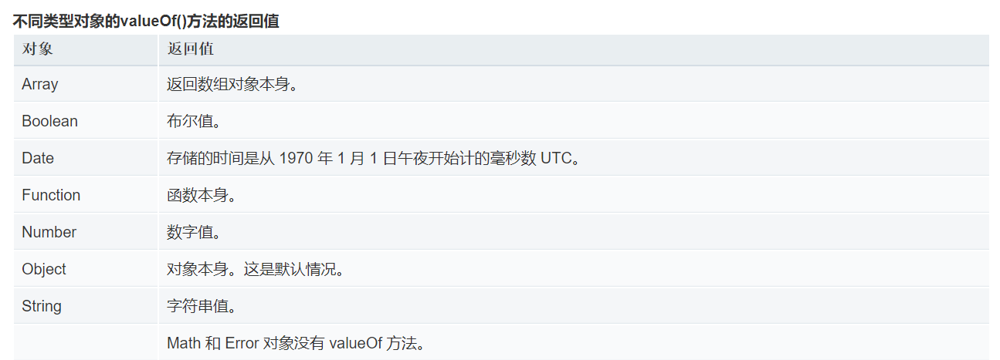
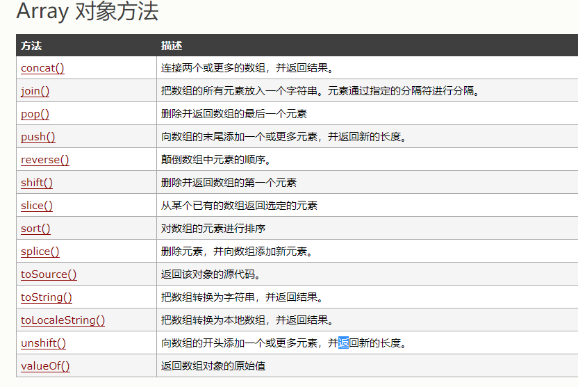
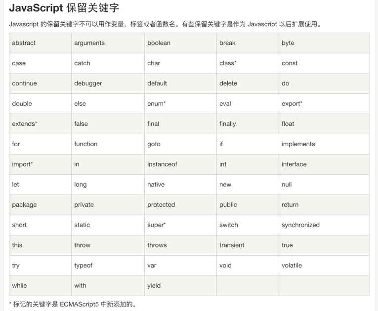
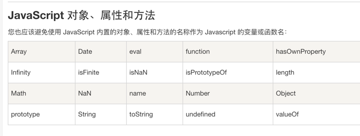
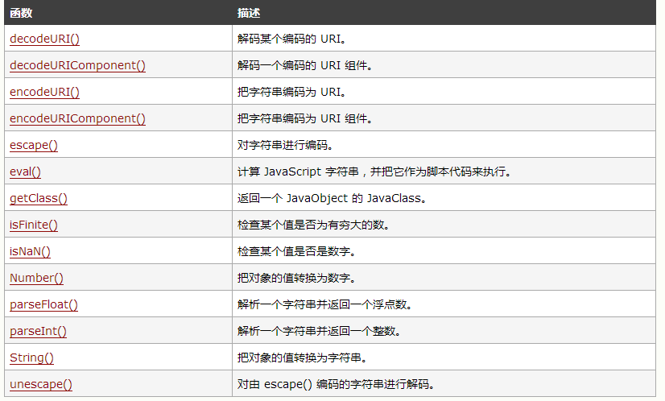

# 常用函数

## forEach()

forEach方法在数组元素为空时会跳过执行回调函数

## valueOf()



## jquery

text()设置或返回被选元素的文本内容
：contains选择器，选取包含指定字符串的元素，字符串也可以是文本
:input()选择器，选取表单元素
attr(name,value)属性操作，设置或返回被选元素的属性和属性值

## toString()

2.toString()将会优先将小数点解析为数字小数点
2..toString()因为连续的两个小数点不符合number的格式规则，第二个小数点才会被解析为调用方法

## history

history.back() 方法加载历史列表中前一个 URL。 这等同于在浏览器中点击后退按钮。

window.history.go(-1);// 向后移动一个页面 (等同于调用 back()):

window.history.go(1);// 向前移动一个页面, 等同于调用了 forward():

## Array



## void

- 立即调用的函数表达式
- JavaScript URIs
- 在箭头函数中避免泄漏

## append

1. append(content)方法

方法作用：向每个匹配的元素内部追加内容。

参数介绍：content (<Content>): 要追加到目标中的内容。

用法示例：

```html
<p>I come from </p><p>I love  </p>

$("p").append("china"); //向所有p标签中追加一个单词china

//结果为：<p>I come from china</p><p>I love china </p>
```

2. appendTo(expr)方法

方法作用：把所有匹配的元素追加到指定的元素元素集合中。

参数介绍：expr (String): 用于匹配元素的jQuery表达式。

用法示例：

```html
<b>I love china </b><p></p>

$("b").appendTo("p");//把标签b追加到p元素中

//结果为：><p><b>I love china </b></p>
```

使用appendTo这个方法是颠倒了常规的$(A).append(B)的操作，即不是把B追加到A中，而是把A追加到B中。

## innerHTML

- test.innerHTML:
从对象的起始位置到终止位置的全部内容,包括Html标签。

- test.innerText:
从起始位置到终止位置的内容, 但它去除Html标签

- test.outerHTML:
除了包含innerHTML的全部内容外, 还包含对象标签本身。

上例中的text.outerHTML的值也就是<div id="test"><span style="color:red">test1</span> test2</div>

## 关键字





## attachEvent

 1.attachEvent与addEventListener的区别

- 支持的浏览器不同。attachEvent在IE9以下的版本中受到支持。其它的都支持addEventListener。
- 参数不同。addEventListener第三个参数可以指定是否捕获，而attachEvent不支持捕获。
- 事件名不同。attachEvent第一个参数事件名前要加on，比如el.attachEvent('onclick', handleClick)。
- this不同。attachEvent的this总是Window。addEventListener的this总是当前正在处理事件的那个DOM对象。

attachEvent中的this总是指向全局对象Window

## call apply

call和apply的作用都是改变this作用域，都是在特定作用域中调用函数。当一个对象没有某个方法，而其他对象有，我们就可以使用call或apply实现某个方法的复用。

- apply

区别仅在于传入参数的形式的不同。

apply 接受两个参数,第一个参数指定了函数体内 this 对象的指向,

第二个参数为一个带下标的集合,这个集合可以为数组,也可以为类数组,apply 方法把这个集合中的元素作为参数传递给被调用的函数

```js
var func = function( a, b, c ){ 
    console.log([a,b,c]); //输出:[1,2,3]
};
func.apply( null, [ 1, 2, 3 ] );
```

- 作用

1. 使用 call 方法调用父构造函数

```js
function Product(name, price) {
  this.name = name;
  this.price = price;
}

function Food(name, price) {
  Product.call(this, name, price);
  this.category = 'food';
}

function Toy(name, price) {
  Product.call(this, name, price);
  this.category = 'toy';
}

var cheese = new Food('feta', 5);
var fun = new Toy('robot', 40);
```

2. 调用匿名函数

```js
var animals = [
  { species: 'Lion', name: 'King' },
  { species: 'Whale', name: 'Fail' }
];

for (var i = 0; i < animals.length; i++) {
  (function(i) {
    this.print = function() {
      console.log('#' + i + ' ' + this.species
                  + ': ' + this.name);
    }
    this.print();
  }).call(animals[i], i);
}
```

3. 使用 call 方法调用函数并且指定上下文的 'this'

```js
function greet() {
  var reply = [this.animal, 'typically sleep between', this.sleepDuration].join(' ');
  console.log(reply);
}

var obj = {
  animal: 'cats', sleepDuration: '12 and 16 hours'
};

greet.call(obj);  // cats typically sleep between 12 and 16 hours
```

4. 使用 call 方法调用函数并且不指定第一个参数（argument）
在下面的例子中，我们调用了 display 方法，但并没有传递它的第一个参数。如果没有传递第一个参数，this 的值将会被绑定为全局对象。

```js
var sData = 'Wisen';

function display() {
  console.log('sData value is %s ', this.sData);
}

display.call();  // sData value is Wisen
//在严格模式下，this 的值将会是 undefined。见下文。
```

- call

call 传入的参数数量不固定, 跟apply 相同的是,第一个参数也是代表函数体内的 this 指向, 从第二个参数开始往后,每个参数被依次传入函数

```js
var func = function( a, b, c ){

    console.log([a,b,c]); //输出:[1,2,3]
};
func.call( null, 1, 2, 3 );
```

## select option

```html
<select id="mySelect">
<option value="1">one</option>
<option value="2">two</option>
<option value="3">three</option>
</select>
```

通过以下script代码来获取选中的value和text

```js
$("#mySelect").val(); //获取选中记录的value值
$("#mySelect option:selected").text(); //获取选中记录的text值

```

2、运用new Option("文本","值")方法添加选项option

var obj = document.getElementById("mySelect");
obj.add(new Option("4","4")); 

3、删除所有选项option

var obj = document.getElementById("mySelect");
obj.options.length = 0; 

4、删除选中选项option

var obj = document.getElementById("mySelect");
var index = obj.selectedIndex;
obj.options.remove(index);

5、修改选中选项option

var obj = document.getElementById("mySelect");
var index = obj.selectedIndex;
obj.options[index] = new Option("three",3); //更改对应的值
obj.options[index].selected = true; //保持选中状态

6、删除select

var obj = document.getElementById("mySelect");
obj.parentNode.removeChild(obj); //移除当前对象 

7、select选择的响应事件

$("#mySelect").change(function(){ //添加所需要执行的操作代码}) 

## setTimeout

```js
function checkState(){
 alert("liyuming");
 }
 window.setTimeout(checkState(), 10000); //立即被调用

window.setTimeout(checkState, 10000); // 10s后被调用
window.setTimeout("checkState()", 10000); //10s后被调用 注意和第一个的区别 有引号
```

## 全局函数



## 字符串连接

+的处理机制是：新建一个临时字符串，将新字符串赋值为a+b，然后返回这个临新字符串并同时销毁原始字符串，所以字符串连接效率较低。所以用Array.join()不会新建临时字符串效率更高。

## parseInt()

parseInt(string, radix)   将一个字符串 string 转换为 radix 进制的整数， radix 为介于2-36之间的数。

## 类型转换

在 JS 中，只有 0，-0，NaN，""，null，undefined 这六个值转布尔值时，结果为 false

## in

```js
// 数组
var trees = new Array("redwood", "bay", "cedar", "oak", "maple");
0 in trees        // 返回true
3 in trees        // 返回true
6 in trees        // 返回false
"bay" in trees    // 返回false (必须使用索引号,而不是数组元素的值)

"length" in trees // 返回true (length是一个数组属性)

Symbol.iterator in trees // 返回true (数组可迭代，只在ES2015+上有效)


// 内置对象
"PI" in Math          // 返回true

// 自定义对象
var mycar = {make: "Honda", model: "Accord", year: 1998};
"make" in mycar  // 返回true
"model" in mycar // 返回true
```

## round

Math.round(）函数返回一个数字四舍五入后最接近的整数

如果参数的小数部分大于0.5，四舍五入到相邻的绝对值更大的整数

如果参数的小数部分小于0.5，四舍五入到相邻的绝对值更小的整数

如果参数的小数部分等于0.5，四舍五入到相邻的在正无穷（+∞）方向上的整数。

## number

Number()函数将字符串转换为数字，不能转换则返回NaN

## with

 1.while的话只是在函数局部环境或者全局环境运行，并不会改变作用域链。

 2.try catch红皮书第四章讲的清清楚楚：虽然执行环境的类型总共只有两种--全局和局部（函数），但还是有其他办法来延长作用域链。这么说是因为有些语句可以在作用域链的前端临时增加一个变量对象，该变量对象会在代码执行后被移除。在两种情况下回发生这种现象。具体来说，就是当执行流进入下列任何一个语句时，作用域链就会得到加强：     try catch语句的catch块；     with语句； 这两个语句都会在作用域链的前端添加一个变量对象。对WITH语句来说，将会指定的对象添加到作用域链中。对catch语句来说，会创建一个新的变量对象，其中包含的是被抛出的错误对象的声明。 Example： function builderUrl(){      var qs="?debug=true";      with(location){      var url = href + qs;         }     return url; } 在此，with语句接受的是location对象，因此其变量对象中就包含了Location对象的所有属性和方法，而这个变量对象被添加到了作用域链的前端。builderUrl()函数中定义了一个变量qs。当在with语句中引用变量href时（实际引用的是location.href），可以在当前执行环境的变量对象中找到。当引用变量qs时，引用的则是在buildUrl()中定义的那个变量，而该变量位于函数环境的变量对象中。至于with语句内部，则定义了一个名为url的变量，因而url就成了函数执行环节的一个部分，所以可以作为函数的值被返回。

## ||

短路或  如果第一项是true 则结果为true 如果第一项为false 结果 为第二项（第二项不做计算直接返回）

## 继承

JavaScript实现继承共6种方式：
原型链继承、借用构造函数继承、组合继承、原型式继承、寄生式继承、寄生组合式继承。

Array.from(arr, mapfn,thisArg)方法，用于将两类可以把对象转换为真正的数组：类似数组的对象和可遍历的对象（部署了Iterator接口的，String，ES6新增的Map和Set）。可以传3个参数，其中第一个是数组，必传；第二个是一个函数（类似map函数），对数组元素进行操作后再返回数组，可选；第三个是对于this关键字的指向，可选。
slice() 方法可从已有的数组中返回选定的元素。
返回值：返回一个新的数组，包含从 start 到 end （不包括该元素）的 arrayObject 中的元素。
说明
请注意，该方法并不会修改数组，而是返回一个子数组。如果想删除数组中的一段元素，应该使用方法 Array.splice()。
所以在这里就是对集合A应用slice，返回一个新的数组，不对数组做任何改变。
展开运算符，把A集合的元素展开后，用数组[]承载，返回新的数组。
map() 方法返回一个新数组，数组中的元素为原始数组元素调用函数处理后的值。
map() 方法按照原始数组元素顺序依次处理元素。
注意： map() 不会对空数组进行检测。
注意： map() 不会改变原始数组。
所以map方法返回了一个新的数组，并且数组中每个元素是A里面的元素。