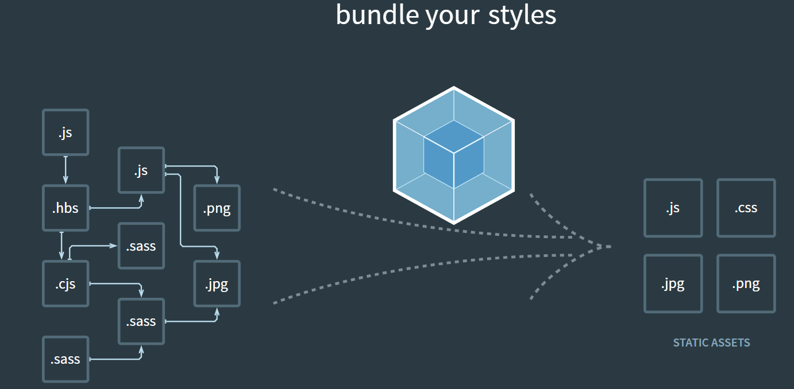

## 定义

Webpack 是一个前端**资源加载/打包**工具(bundler)。它将根据模块的依赖关系进行静态分析，然后将这些模块按照指定的规则生成对应的静态资源。



目前Vue React Angular三大框架的脚手架工具都采用webpack做底层构建

webpack能识别并打包ES module, ComminJS, AMD, CMD等模块规范下的模块，[常见引入模块方法](https://webpack.js.org/concepts/modules/)

webpack最早是js模块打包工具，现在还能打包css，jpg，png等

## webpack究竟是什么

复杂项目会造成文件越来越大，不利于维护。一般进行组件化拆分，封装到不同的类中，便于查找问题。
但是一个主页面下多个js文件会造成整个页面速度加载变慢，从代码中难以看出文件间内部相互关系，引入js顺序问题等造成代码不易维护

解决方法：使用webpack在一个总js文件下import其他js文件

## 项目中安装webpack

1. 安装nodejs
2. npm init
3. npm install webpack webpack-cli --save-dev(最好不要用-g全局安装)

## 基础使用

1. npx webpack index.js 对js文件进行webpack翻译(index.js是打包入口文件)
2. 引入的模块必须使用```export default My_module```导出，导出后才能```import My_module from './My_module'```（这里实例采用ES module模块引入导出方式，其他方式webpack也支持）

## webpack配置文件

1. webpack自带配置文件
2. 如果自己写配置文件可以新建webpack.config.js
3. entry入口；output输出文件名字和位置（可以使用path.resolve(_dirname, 'output_filename')）；如果配置了入口，npx webpack可以不用写入口文件
4. 可以在package.json中配置scripts，通过npm run 来运行webpack
5. mode:production(默认模式)代码会自动压缩