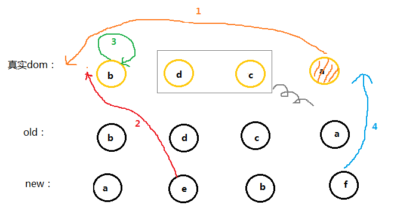

# diff 算法

## DOM解析

1、DOM 树的构建是文档加载完成开始的？ 构建 DOM 树是一个渐进过程，为达到更好的用户体验，渲染引擎会尽快将内容显示在屏幕上，它不必等到整个 HTML 文档解析完成之后才开始构建 render 树和布局。
2、Render 树是 DOM 树和 CSS 样式表构建完毕后才开始构建的？ 这三个过程在实际进行的时候并不是完全独立的，而是会有交叉，会一边加载，一边解析，以及一边渲染。
3、CSS 的解析注意点？ CSS 的解析是从右往左逆向解析的，嵌套标签越多，解析越慢。

## 虚拟DOM

虚拟 DOM 的好处
​	虚拟 DOM 就是为了解决浏览器性能问题而被设计出来的。如前，若一次操作中有 10 次更新 DOM 的动作，虚拟 DOM 不会立即操作 DOM，而是将这 10 次更新的 diff 内容保存到本地一个 JS 对象中，最终将这个 JS 对象一次性 attch 到 DOM 树上，再进行后续操作，避免大量无谓的计算量。所以，用 JS 对象模拟 DOM 节点的好处是，页面的更新可以先全部反映在 JS 对象(虚拟 DOM )上，操作内存中的 JS 对象的速度显然要更快，等更新完成后，再将最终的 JS 对象映射成真实的 DOM，交由浏览器去绘制。

JavaScript 对象来表示 DOM 节点，使用对象的属性记录节点的类型、属性、子节点等。


## 当数据发生变化时，vue 是怎么更新节点的

渲染真实 DOM 的开销是很大，有时候我们修改了某个数据，如果直接渲染到真实 dom 上会引起整个 dom 树的重绘和重排，有没有可能我们**只更新我们修改的那一小块 dom 而不要更新整个 dom**呢？diff 算法能够帮助我们。

先根据真实 DOM 生成一颗 virtual DOM，
当 virtual DOM 某个**节点的数据**改变后会生成一个新的 Vnode，
然后 Vnode 和 oldVnode 作对比，发现有不一样的地方就直接修改在真实的 DOM 上，然后使 oldVnode 的值为 Vnode。

diff 的过程就是调用名为 patch 的函数，比较新旧节点，一边比较一边给真实的 DOM 打补丁。

## virtual DOM 和真实 DOM 的区别

virtual DOM 是将真实的 DOM 的数据抽取出来，以**对象**的形式模拟**树形结构**。
（VNode 和 oldVNode 都是对象，一定要记住）

## diff 的比较方式

在采取 diff 算法比较新旧节点的时候，比较只会在同层级进行, 不会跨层级比较。

```js
<div>
    <p>123</p>
</div>

<div>
    <span>456</span>
</div>
```

上面的代码会分别比较同一层的两个 div 以及第二层的 p 和 span，但是不会拿 div 和 span 作比较。


## diff 流程图


当数据发生改变时，set 方法会让调用 Dep.notify 通知所有订阅者 Watcher，订阅者就会调用 patch 给真实的 DOM 打补丁，更新相应的视图。

### 先判断两个节点是否值得比较

如果两个节点都是一样的，那么就深入检查他们的子节点。如果两个节点不一样那就说明 Vnode 完全被改变了，就可以直接替换 oldVnode。

```js
function sameVnode(a, b) {
  return (
    a.key === b.key && // key值
    a.tag === b.tag && // 标签名
    a.isComment === b.isComment && // 是否为注释节点
    // 是否都定义了data，data包含一些具体信息，例如onclick , style
    isDef(a.data) === isDef(b.data) &&
    sameInputType(a, b) // 当标签是<input>的时候，type必须相同
  );
}
```

### 不值得比较

在父元素下面生成新元素，添加新元素，删除旧元素

```js
function patch(oldVnode, vnode) {
  // some code
  if (sameVnode(oldVnode, vnode)) {
    patchVnode(oldVnode, vnode);
  } else {
    const oEl = oldVnode.el; // 当前oldVnode对应的真实元素节点
    let parentEle = api.parentNode(oEl); // 父元素
    createEle(vnode); // 根据Vnode生成新元素
    if (parentEle !== null) {
      api.insertBefore(parentEle, vnode.el, api.nextSibling(oEl)); // 将新元素添加进父元素
      api.removeChild(parentEle, oldVnode.el); // 移除以前的旧元素节点
      oldVnode = null;
    }
  }
  // some code
  return vnode;
}
```

### 值得比较

找到对应的真实dom，称为el
判断Vnode和oldVnode是否指向同一个对象，如果是，那么直接return
如果他们都有文本节点并且不相等，那么将el的文本节点设置为Vnode的文本节点。
如果oldVnode有子节点而Vnode没有，则删除el的子节点
如果oldVnode没有子节点而Vnode有，则将Vnode的子节点真实化之后添加到el
如果两者都有子节点，则执行updateChildren函数比较子节点，这一步很重要

```js
patchVnode (oldVnode, vnode) {
    const el = vnode.el = oldVnode.el
    let i, oldCh = oldVnode.children, ch = vnode.children
    if (oldVnode === vnode) return
    if (oldVnode.text !== null && vnode.text !== null && oldVnode.text !== vnode.text) {
        api.setTextContent(el, vnode.text)
    }else {
        updateEle(el, vnode, oldVnode)
    	if (oldCh && ch && oldCh !== ch) {
            updateChildren(el, oldCh, ch)
    	}else if (ch){
            createEle(vnode) //create el's children dom
    	}else if (oldCh){
            api.removeChildren(el)
    	}
    }
}
```

### 继续比较子节点

将Vnode的子节点Vch和oldVnode的子节点oldCh提取出来
oldCh和vCh各有两个头尾的变量StartIdx和EndIdx，它们的2个变量相互比较，一共有4种比较方式。如果4种比较都没匹配，如果设置了key，就会用key进行比较，在比较的过程中，变量会往中间靠，一旦StartIdx>EndIdx表明oldCh和vCh至少有一个已经遍历完了，就会结束比较。

如果是oldS和E匹配上了，那么真实dom中的第一个节点会移到最后
如果是oldE和S匹配上了，那么真实dom中的最后一个节点会移到最前，匹配上的两个指针向中间移动
如果四种匹配没有一对是成功的，分为两种情况

如果新旧子节点都存在key，那么会根据oldChild的key生成一张hash表，用S的key与hash表做匹配，匹配成功就判断S和匹配节点是否为sameNode，如果是，就在真实dom中将成功的节点移到最前面，否则，将S生成对应的节点插入到dom中对应的oldS位置，S指针向中间移动，被匹配old中的节点置为null。
如果没有key,则直接将S生成新的节点插入真实DOM（ps：这下可以解释为什么v-for的时候需要设置key了，如果没有key那么就只会做四种匹配，就算指针中间有可复用的节点都不能被复用了）




这个匹配过程的结束有两个条件：

oldS > oldE表示oldCh先遍历完，那么就将多余的vCh根据index添加到dom中去（如上图）
S > E表示vCh先遍历完，那么就在真实dom中将区间为[oldS, oldE]的多余节点删掉
