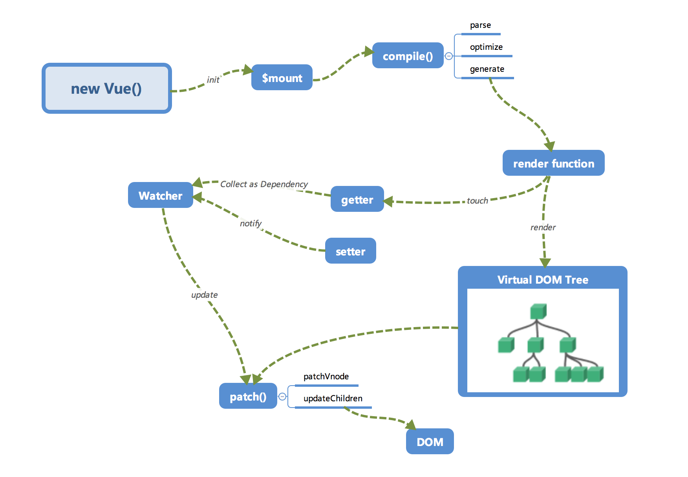

# Vue.js

## Vue 组件 data 为什么必须是函数

每个组件都是 Vue 的实例。(组件可能被用来创建多个实例)
组件共享 data 属性，当 data 的值是同一个引用类型的值时，改变其中一个会影响其他。

```js
data() {
    return {
        a:1,
        b:2
    }
}
```

## css 只在当前组件起作用

答：在 style 标签中写入 scoped 即可 例如：`<style lang="stylus" scoped></style>`

## vue.js 的两个核心是什么

答：数据驱动、组件系统

## vue 几种常用的指令

v-for
v-if
v-bind(缩写可以把 v-bind 省略)响应式地更新 HTML attribute
v-on（缩写为@）它用于监听 DOM 事件
v-show
v-else

## vue 常用的修饰符

答：.prevent: 提交事件不再重载页面；.stop: 阻止单击事件冒泡；.self: 当事件发生在该元素本身而不是子元素的时候会触发；.capture: 事件侦听，事件发生的时候会调用

## vue 中 key 值的作用

答：当 Vue.js 用 v-for 正在更新已渲染过的元素列表时，它默认用“就地复用”策略。如果数据项的顺序被改变，Vue 将不会移动 DOM 元素来匹配数据项的顺序， 而是简单复用此处每个元素，并且确保它在特定索引下显示已被渲染过的每个元素。key 的作用主要是为了高效的更新虚拟 DOM。

## v-on

```js
<input
     type="text"
     v-on="{
     input:onInput,
     focus:onFocus,
     blur:onBlur,
     }"
   >
<input type="text" @click="onclick" @input="onInput" @focus="onFocus">
```

## vue 的计算属性

答：**在模板中放入太多的逻辑会让模板过重且难以维护**，在需要对数据进行复杂处理，且可能多次使用的情况下，尽量采取计算属性的方式。
好处：
使得数据处理结构清晰；
依赖于数据，数据更新，处理结果自动更新；
计算属性内部 this 指向 vm 实例；
在 template 调用时，直接写计算属性名即可；
常用的是 getter 方法，获取数据，也可以使用 set 方法改变数据；
相较于 methods，不管依赖的数据变不变，methods 都会重新计算，但是依赖数据不变的时候 computed 从缓存中获取，不会重新计算。

### getter setter

计算属性默认只有 getter，不过在需要时你也可以提供一个 setter：

```js
var vm = new Vue({
  el: '#example',
  data: {
    message: 'Hello'
  },
  computed: {
    // 计算属性的 getter
    reversedMessage: function () {
      // `this` 指向 vm 实例
      return this.message.split('').reverse().join('')
    }
  }
})


computed: {
  fullName: {
    // getter
    get: function () {
      return this.firstName + ' ' + this.lastName
    },
    // setter
    set: function (newValue) {
      var names = newValue.split(' ')
      this.firstName = names[0]
      this.lastName = names[names.length - 1]
    }
  }
}
```

### 计算属性 vs 普通属性

计算属性的属性值必须是一个函数。

### 计算属性 vs 方法

- computed 是可以缓存的，只有依赖数据改变才会重新计算；methods 不能缓存；
- computed是响应式的， methods并非响应式
- computed不支持异步
- computed定义的成员

## 侦听属性

Vue 提供了一种更通用的方式来观察和响应 Vue 实例上的数据变动：侦听属性 watch。watch 中可以执行任何逻辑，如函数节流，Ajax 异步获取数据，甚至操作 DOM（不建议）。

### watch computed

watch：监测的是属性值， 只要属性值发生变化，其都会触发执行回调函数来执行一系列操作。
computed：监测的是依赖值，依赖值不变的情况下其会直接读取缓存进行复用，变化的情况下才会重新计算。


计算属性不能执行异步任务，计算属性必须同步执行。也就是说计算属性不能向服务器请求或者执行异步任务。如果遇到异步任务，就交给侦听属性。watch 也可以检测 computed 属性。

## 单页面应用（SPA）

单页面应用（SPA），通俗一点说就是指只有一个主页面的应用，浏览器一开始要加载所有必须的 html, js, css。所有的页面内容都包含在这个所谓的主页面中。但在写的时候，还是会分开写（页面片段），然后在交互的时候由路由程序动态载入，单页面的页面跳转，仅刷新局部资源。多应用于 pc 端。

多页面应用（MPA）
多页面（MPA），就是指一个应用中有多个页面，页面跳转时是整页刷新。

### 单页面的优点

用户体验好，快，内容的改变不需要重新加载整个页面，基于这一点 spa 对服务器压力较小。
前后端分离。
页面效果会比较炫酷（比如切换页面内容时的专场动画）。

### 单页面缺点

不利于 seo。
导航不可用，如果一定要导航需要自行实现前进、后退。（由于是单页面不能用浏览器的前进后退功能，所以需要自己建立堆栈管理）。
初次加载时耗时多。
页面复杂度提高很多。

## vue router

### 怎么定义 vue-router 的动态路由? 怎么获取传过来的值

答：在 router 目录下的 index.js 文件中，对 path 属性加上 /:id，使用 router 对象的 params.id 获取。

### hash模式 和 history模式

hash模式：在浏览器中符号“#”，#以及#后面的字符称之为hash，用window.location.hash读取；
特点：hash虽然在URL中，但不被包括在HTTP请求中；用来指导浏览器动作，对服务端安全无用，hash不会重加载页面。
hash 模式下，仅 hash 符号之前的内容会被包含在请求中，如 http://www.xxx.com，因此对于后端来说，即使没有做到对路由的全覆盖，也不会返回 404 错误。

history模式：history采用HTML5的新特性；且提供了两个新方法：pushState（），replaceState（）可以对浏览器历史记录栈进行修改，以及popState事件的监听到状态变更。
history 模式下，前端的 URL 必须和实际向后端发起请求的 URL 一致，如 http://www.xxx.com/items/id。后端如果缺少对 /items/id 的路由处理，将返回 404 错误。Vue-Router 官网里如此描述：“不过这种模式要玩好，还需要后台配置支持……所以呢，你要在服务端增加一个覆盖所有情况的候选资源：如果 URL 匹配不到任何静态资源，则应该返回同一个 index.html 页面，这个页面就是你 app 依赖的页面。”

### 钩子函数

导航被触发。
在失活的组件里调用 beforeRouteLeave 守卫。
调用全局的 beforeEach 守卫。
在重用的组件里调用 beforeRouteUpdate 守卫 (2.2+)。
在路由配置里调用 beforeEnter。
解析异步路由组件。
在被激活的组件里调用 beforeRouteEnter。
调用全局的 beforeResolve 守卫 (2.5+)。
导航被确认。
调用全局的 afterEach 钩子。
触发 DOM 更新。
调用 beforeRouteEnter 守卫中传给 next 的回调函数，创建好的组件实例会作为回调函数的参数传入。

beforeEach主要有3个参数to，from，next：

to：route即将进入的目标路由对象，

from：route当前导航正要离开的路由

next：function一定要调用该方法resolve这个钩子。执行效果依赖next方法的调用参数。可以控制网页的跳转。

## 数据传递

### props

子组件写props接收父组件传递的值，父组件通过v-bind:传递

### emit

从子组件 Emit（派发） 一个事件，子组件在父组件声明的时候写v-on，具体执行函数在父组件中声明

## vuex


## keep-alive

keep-alive是 Vue 内置的一个组件，可以使被包含的组件保留状态，或避免重新渲染。
keep-alive新加入了两个属性: include(包含的组件缓存) 与 exclude(排除的组件不缓存，优先级大于include) 。

## Vue的生命周期

beforeCreate（创建前） 在数据观测和初始化事件还未开始
created（创建后） 完成数据观测，属性和方法的运算，初始化事件，$el属性还没有显示出来
beforeMount（载入前） 在挂载开始之前被调用，相关的render函数首次被调用。实例已完成以下的配置：编译模板，把data里面的数据和模板生成html。注意此时还没有挂载html到页面上。
mounted（载入后） 在el 被新创建的 vm.$el 替换，并挂载到实例上去之后调用。实例已完成以下的配置：用上面编译好的html内容替换el属性指向的DOM对象。完成模板中的html渲染到html页面中。此过程中进行ajax交互。
beforeUpdate（更新前） 在数据更新之前调用，发生在虚拟DOM重新渲染和打补丁之前。可以在该钩子中进一步地更改状态，不会触发附加的重渲染过程。
updated（更新后） 在由于数据更改导致的虚拟DOM重新渲染和打补丁之后调用。调用时，组件DOM已经更新，所以可以执行依赖于DOM的操作。然而在大多数情况下，应该避免在此期间更改状态，因为这可能会导致更新无限循环。该钩子在服务器端渲染期间不被调用。
beforeDestroy（销毁前） 在实例销毁之前调用。实例仍然完全可用。
destroyed（销毁后） 在实例销毁之后调用。调用后，所有的事件监听器会被移除，所有的子实例也会被销毁。该钩子在服务器端渲染期间不被调用。
1.什么是vue生命周期？
答： Vue 实例从创建到销毁的过程，就是生命周期。从开始创建、初始化数据、编译模板、挂载Dom→渲染、更新→渲染、销毁等一系列过程，称之为 Vue 的生命周期。

2.vue生命周期的作用是什么？
答：它的生命周期中有多个事件钩子，让我们在控制整个Vue实例的过程时更容易形成好的逻辑。

3.vue生命周期总共有几个阶段？
答：它可以总共分为8个阶段：创建前/后, 载入前/后,更新前/后,销毁前/销毁后。

4.第一次页面加载会触发哪几个钩子？
答：会触发 下面这几个beforeCreate, created, beforeMount, mounted 。

5.DOM 渲染在 哪个周期中就已经完成？
答：DOM 渲染在 mounted 中就已经完成了。



## 服务器端渲染 (SSR)

Vue SSR 的实现，主要就是把 Vue 的组件输出成一个完整 HTML

什么是服务器端渲染 (SSR)？
Vue.js 是构建客户端应用程序的框架。默认情况下，可以在浏览器中输出 Vue 组件，进行生成 DOM 和操作 DOM。然而，也可以将同一个组件渲染为服务器端的 HTML 字符串，将它们直接发送到浏览器，最后将这些静态标记"激活"为客户端上完全可交互的应用程序。

服务器渲染的 Vue.js 应用程序也可以被认为是"同构"或"通用"，因为应用程序的大部分代码都可以在服务器和客户端上运行。

与传统 SPA (单页应用程序 (Single-Page Application)) 相比，服务器端渲染 (SSR) 的优势主要在于：

更好的 SEO，由于搜索引擎爬虫抓取工具可以直接查看完全渲染的页面。

请注意，截至目前，Google 和 Bing 可以很好对同步 JavaScript 应用程序进行索引。在这里，同步是关键。如果你的应用程序初始展示 loading 菊花图，然后通过 Ajax 获取内容，抓取工具并不会等待异步完成后再行抓取页面内容。也就是说，如果 SEO 对你的站点至关重要，而你的页面又是异步获取内容，则你可能需要服务器端渲染(SSR)解决此问题。

更快的内容到达时间 (time-to-content)，特别是对于缓慢的网络情况或运行缓慢的设备。无需等待所有的 JavaScript 都完成下载并执行，才显示服务器渲染的标记，所以你的用户将会更快速地看到完整渲染的页面。通常可以产生更好的用户体验，并且对于那些「内容到达时间(time-to-content) 与转化率直接相关」的应用程序而言，服务器端渲染 (SSR) 至关重要。

使用服务器端渲染 (SSR) 时还需要有一些权衡之处：

开发条件所限。浏览器特定的代码，只能在某些生命周期钩子函数 (lifecycle hook) 中使用；一些外部扩展库 (external library) 可能需要特殊处理，才能在服务器渲染应用程序中运行。

涉及构建设置和部署的更多要求。与可以部署在任何静态文件服务器上的完全静态单页面应用程序 (SPA) 不同，服务器渲染应用程序，需要处于 Node.js server 运行环境。

更多的服务器端负载。在 Node.js 中渲染完整的应用程序，显然会比仅仅提供静态文件的 server 更加大量占用 CPU 资源 (CPU-intensive - CPU 密集)，因此如果你预料在高流量环境 (high traffic) 下使用，请准备相应的服务器负载，并明智地采用缓存策略。

在对你的应用程序使用服务器端渲染 (SSR) 之前，你应该问的第一个问题是，是否真的需要它。这主要取决于内容到达时间 (time-to-content) 对应用程序的重要程度。例如，如果你正在构建一个内部仪表盘，初始加载时的额外几百毫秒并不重要，这种情况下去使用服务器端渲染 (SSR) 将是一个小题大作之举。然而，内容到达时间 (time-to-content) 要求是绝对关键的指标，在这种情况下，服务器端渲染 (SSR) 可以帮助你实现最佳的初始加载性能。

## vue响应原理

数据劫持+发布订阅模式

要实现双向数据绑定大致可以划分为三个模块：
Observer：数据监听器。监听数据，通知订阅者。
Compiler：指令解析器。解析模板指令，初始化视图。
Watcher：订阅者。添加订阅者，获取通知，然后调用update更新视图

### 另一种方式

Vue 的响应式原理是使用 Object.defineProperty 追踪依赖，当属性被访问或改变时通知变化。
有两个不足之处：

不能检测到增加或删除的属性。
数组方面的变动，如根据索引改变元素，以及直接改变数组长度时的变化，不能被检测到。

原因差不多，无非就是没有被 getter/setter 。
第一个比较容易理解，为什么数组长度不能被 getter/setter ？
在知乎上找了一个答案：如果你知道数组的长度，理论上是可以预先给所有的索引设置 getter/setter 的。但是一来很多场景下你不知道数组的长度，二来，如果是很大的数组，预先加 getter/setter 性能负担较大。
现在有一个替代的方案 Proxy，但这东西兼容性不好，迟早要上的。
Proxy，在目标对象之前架设一层拦截。具体，可以参考 http://es6.ruanyifeng.com/#docs/reference

## 数据绑定

### 为什么不能检测数组元素直接赋值或改变length

简单点说如果监测得属性是值类型，当值改变就会触发set;如果是引用类型，只有当引用改变得时候才会触发set；

### 为什么不能检测动态添加得对象属性

因为defineProperty是对属性list进行监测，添加name属性后list的引用没变所以当然不会触发set啊。

### vue如何实现数组绑定

1)、针对数组，vue提供了变异方法（push、pop、shift、unshift、sort、reverse、splice），为什么要提供呢，因为Array.prototype上的方法不会改变属性的引用，所以不会更新视图。通过调用变异方法的时候手动去通知更新视图。

2)Vue.set(object, key, value) 方法将响应属性添加到嵌套的对象上.在Vue.js里面只有data中已经存在的属性才会被Observe为响应式数据, 如果你是新增的属性是不会成为响应式数据, 因此Vue提供了一个api(vm.$set)来解决这个问题。

原理:vm.$set()在new Vue()时候就被注入到Vue的原型上。

### proxy

vue3之前版本用Object.defineProperty, 3.0之后用Proxy实现数据绑定。
Proxy是 ES6 中新增的一个特性。


### proxy和defineProperty区别

#### 数据劫持的优缺点

优点：

- 不需要显示的调用
- 直接得到精确的变化数据，当属性值改变可以精确的获取变化的内容，不需要额外的diff操作。

缺点：

- 不能监听数组
- 只能监听属性，而不是整个对象，需要遍历属性。
- 只能监听属性变化，不能监听属性的增删

#### proxy优缺点

优点：

- 可以监听数组
- 可以监听整个对象
- 13种拦截方法，非常强大（get, set, apply, has, construct, deleteProperty, defineProperty, getOwnPropertyDescriptor, getPrototypeOf, isExtensible, ownKeys, preventExtensions, setPrototypeOf）
- 返回新对象而不是直接修改原对象。

缺点：

兼容性不好

