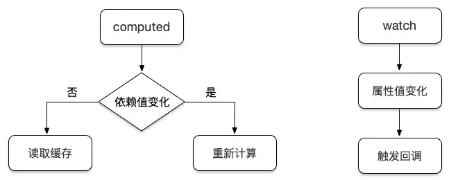

# Vue.js

## Vue 组件 data 为什么必须是函数

每个组件都是 Vue 的实例。(组件可能被用来创建多个实例)
组件共享 data 属性，当 data 的值是同一个引用类型的值时，改变其中一个会影响其他。

```js
data() {
    return {
        a:1,
        b:2
    }
}
```

## css 只在当前组件起作用

答：在 style 标签中写入 scoped 即可 例如：```<style lang="stylus" scoped></style>```

## vue.js 的两个核心是什么

答：数据驱动、组件系统

## vue 几种常用的指令

v-for
v-if
v-bind(缩写可以把 v-bind 省略)响应式地更新 HTML attribute
v-on（缩写为@）它用于监听 DOM 事件
v-show
v-else

## vue 常用的修饰符

答：.prevent: 提交事件不再重载页面；.stop: 阻止单击事件冒泡；.self: 当事件发生在该元素本身而不是子元素的时候会触发；.capture: 事件侦听，事件发生的时候会调用

## .vue中 key 值的作用？
答：当 Vue.js 用 v-for 正在更新已渲染过的元素列表时，它默认用“就地复用”策略。如果数据项的顺序被改变，Vue 将不会移动 DOM 元素来匹配数据项的顺序， 而是简单复用此处每个元素，并且确保它在特定索引下显示已被渲染过的每个元素。key的作用主要是为了高效的更新虚拟DOM。

## v-on

```js
<input
     type="text"
     v-on="{
     input:onInput,
     focus:onFocus,
     blur:onBlur,
     }"
   >
<input type="text" @click="onclick" @input="onInput" @focus="onFocus">
```

## vue的计算属性？
答：在模板中放入太多的逻辑会让模板过重且难以维护，在需要对数据进行复杂处理，且可能多次使用的情况下，尽量采取计算属性的方式。
好处：
使得数据处理结构清晰；
依赖于数据，数据更新，处理结果自动更新；
计算属性内部this指向vm实例；④在template调用时，直接写计算属性名即可；
常用的是getter方法，获取数据，也可以使用set方法改变数据；
相较于methods，不管依赖的数据变不变，methods都会重新计算，但是依赖数据不变的时候computed从缓存中获取，不会重新计算。

### 计算属性 vs 普通属性
可以像绑定普通属性一样在模板中绑定计算属性，在定义上有区别：计算属性的属性值必须是一个函数。

### 3.计算属性 vs 方法
两者最主要的区别：computed 是可以缓存的，methods 不能缓存；

## 侦听属性
Vue 提供了一种更通用的方式来观察和响应 Vue 实例上的数据变动：侦听属性watch。watch中可以执行任何逻辑，如函数节流，Ajax异步获取数据，甚至操作 DOM（不建议）。

### watch computed

watch：监测的是属性值， 只要属性值发生变化，其都会触发执行回调函数来执行一系列操作。
computed：监测的是依赖值，依赖值不变的情况下其会直接读取缓存进行复用，变化的情况下才会重新计算。
